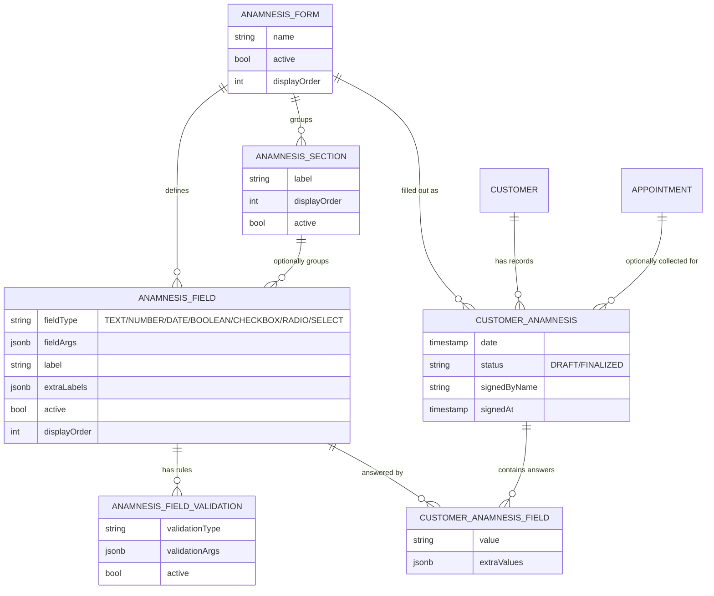
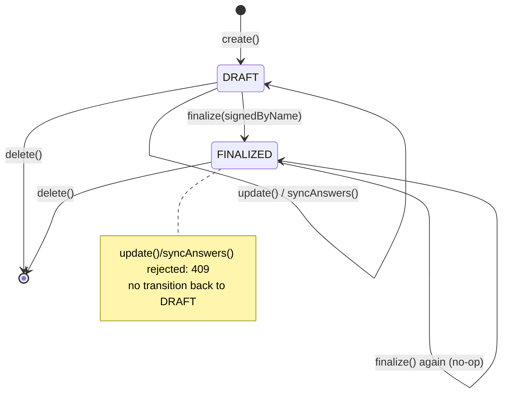
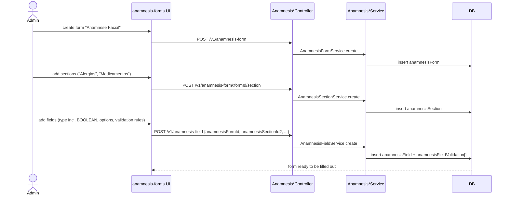
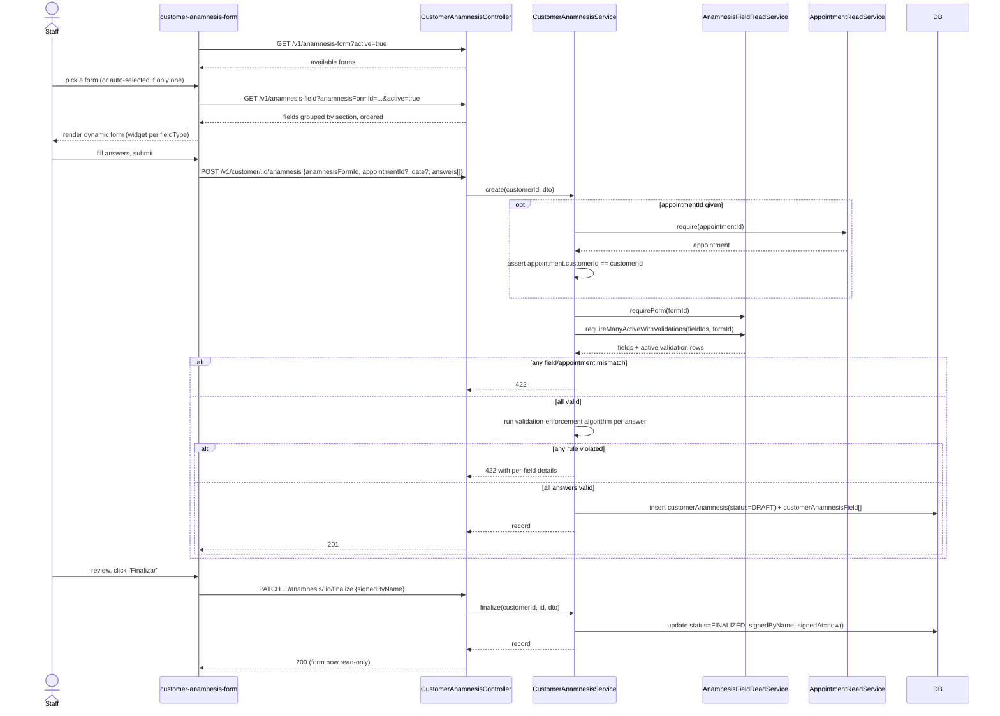
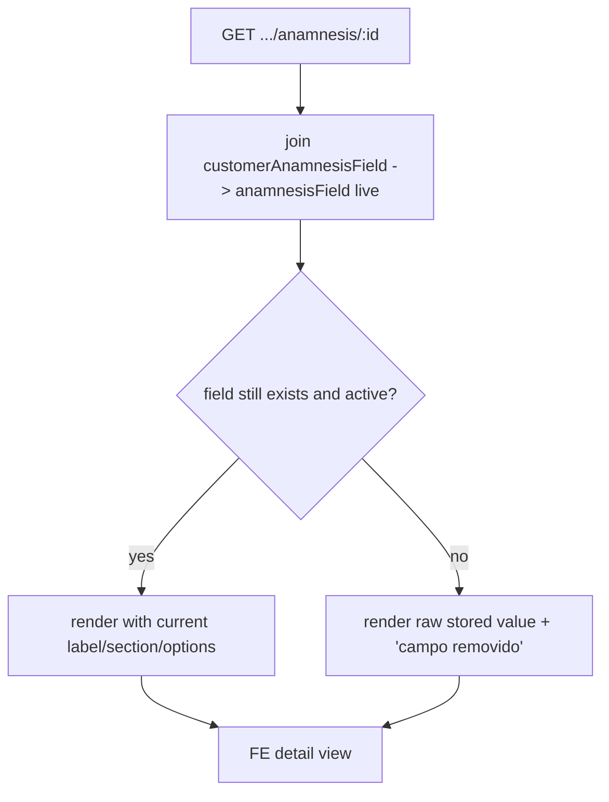

<!--
Pre-implementation design doc for the anamnesis feature (anamnesis-field +
customer-anamnesis). Living document — update it as the design changes,
during and after implementation, rather than letting it drift from
docs/features/anamnesis-field/ and docs/features/customer-anamnesis/ once
those are created. Once the feature ships, those per-feature FUNCTIONAL.md/
DATABASE.md docs are the source of truth for current behavior; this file
stays as the record of how we got there and why.
-->

# Anamnesis feature — plan

## Post-implementation revision: snapshot the answer, not the definition

While reviewing the backend, we caught a real gap in this plan's original
design: `anamnesis_field`/`anamnesis_section` were plain in-place-editable
rows, but `customer_anamnesis_field` answers pin to a specific field id —
editing a field's type/options/label in place would silently rewrite how
every past answer referencing it reads.

Two fixes were tried, in order:

1. **Version the definitions** (`anamnesis_field`/`anamnesis_section`
   append-only, edit = deactivate + insert a new row with a
   `previousVersionId` pointer). Built first, then reverted — it protects
   the *definition* rather than the *answer*, which pushed real complexity
   onto anything that referenced the versioned rows (a plain section
   rename raised genuinely unresolved questions about whether it should
   cascade into re-versioning every field grouped under it), without a
   clean answer either way.
2. **Snapshot onto the answer instead** (chosen). `anamnesis_field`/
   `anamnesis_section` stay ordinary mutable rows;
   `customer_anamnesis_field` copies the label/type/options/section it
   needs onto itself at answer time — same pattern already used by
   `sale_item.priceApplied`/`appointment_item.priceApplied` elsewhere in
   this codebase. Full reasoning (including why the versioning attempt was
   abandoned) is in
   [customer-anamnesis/DATABASE.md](../features/customer-anamnesis/DATABASE.md)'s
   Design decisions.

Full detail is in `docs/features/{anamnesis-field,customer-anamnesis}/
{FUNCTIONAL,DATABASE}.md`, which are the source of truth going forward —
this note just records that the plan below (written before either
correction) understates it wherever it describes
`customer_anamnesis_field` as storing only `value`/`extraValues`, or
field/section `update` as changing the row's id.

## Context

`anamnesis-field` and `customer` already have four DB tables modeled
(`anamnesis_field`, `anamnesis_field_validation`, `customer_anamnesis`,
`customer_anamnesis_field`) but zero implementation: `AnamnesisFieldController`
/`Service` are empty stubs, there's no `customer-anamnesis` feature at all, and
nothing on the frontend. This is a health/intake questionnaire: clinic admins
define custom fields (allergies, medications, skin type, etc.), and front-
desk/esthetician staff fill one out per customer per visit/period.

Before drafting the implementation plan, we reviewed whether the original
four-table schema was capable of a "really complete and customizable"
clinic anamnesis. It wasn't, on several points. After discussion, these are
now folded into this plan (rather than left for later):

- **Sections/grouping.** Real intake forms are organized ("Allergies",
  "Medications", "Skin history"), not one flat field list.
- **Form templates.** One global questionnaire per org wasn't enough — a
  facial-treatment intake and a laser/body intake usually ask different
  things. Fields now belong to a named, selectable `anamnesis_form`.
- **Appointment linkage.** `customer_anamnesis` gets a nullable
  `appointmentId` so a record can say which visit it was collected for.
- **A dedicated boolean field type.** `CHECKBOX` is a multi-select
  checklist (confirmed earlier); a plain yes/no question needed its own
  `BOOLEAN` type rather than a two-option `RADIO` workaround.
- **Simple consent/signature.** A typed `signedByName` + `signedAt` on the
  record — not a full signature-capture widget, just enough to say "this
  person confirmed this record."
- **A draft/finalized lifecycle.** `status` (`DRAFT`/`FINALIZED`) plus a
  dedicated `finalize` action that locks the record (and sets the
  signature) — prevents silently editing a record after it's been
  confirmed.

Two items from that review are **deliberately left out and recorded in
`TODO.md`** instead — genuinely harder or lower-value right now:
- **Conditional/branching field logic** ("only show field B if field A =
  yes") — nontrivial to design well, explicitly deferred per discussion.
- **Full field-level change-history/audit log** beyond the plain
  `lastUpdatedBy`/`updatedAt` `baseEntity` already gives every table —
  `status`/`finalize` handles locking a confirmed record, but a complete
  audit trail (who changed what, when, across edits) is a separate,
  heavier feature.
- The inherent **EAV reporting weakness** of `value: varchar` (can't
  `WHERE`-filter across customers by answer without app-layer parsing) is
  also noted there — not fixable without a secondary index/materialization,
  not worth building speculatively.

Two more decisions were confirmed with the user earlier:
- **History, not a living profile.** Each `customer_anamnesis` row is an
  immutable-ish dated snapshot; a customer can have many over time.
- **`CHECKBOX` is a multi-select checklist**, not a boolean toggle — see
  `BOOLEAN` above for the yes/no case.

## Data model

### New tables

- **`anamnesis_form`** — a named, selectable questionnaire template:
  `name`, `description?`, `active`, `displayOrder`. Tenant-scoped
  (`addAuthenticatedPolicy`) like every other org-customized table.
- **`anamnesis_section`** — a named group of fields within one form:
  `anamnesisFormId` FK (required), `label`, `displayOrder`, `active`.
  Optional at the field level — an admin can add fields before organizing
  them into sections.

Both are new soft-deletable, RLS-scoped tables (`baseEntity(...)` + a fresh
3–5 char id prefix not already used in `main-entities.ts`). Standard
`migrations:generate:main` picks up their columns *and* RLS policies
(`addAuthenticatedPolicy`/`addDeletedAtPolicies`, same as every other
table), but per `docs/MIGRATIONS.md` the `tg_soft_delete` trigger never is
— hand-add it via `migrations:generate-empty:main`, same as the existing
anamnesis tables already needed.

### Changes to the existing four tables

- `anamnesis_field` gains `anamnesisFormId` (required FK) and
  `anamnesisSectionId` (nullable FK). Service-layer invariant: a field's
  `anamnesisSectionId`, when set, must belong to the same
  `anamnesisFormId` as the field itself.
- `anamnesis_field.fieldType` enum gains `BOOLEAN` — a single yes/no
  toggle, distinct from `CHECKBOX`'s multi-select checklist. No
  `fieldArgs.options` needed (nothing to choose from); the answer's `value`
  column stores `'true'`/`'false'` directly, `extraValues` stays unused.
  Enum-value migration reviewed like any other (Postgres `ALTER TYPE ...
  ADD VALUE`).
- `customer_anamnesis` gains:
  - `anamnesisFormId` (required FK) — which template this record answers.
  - `appointmentId` (nullable FK → `appointment.id`) — which visit this
    record was collected for, if any. Set only at creation (immutable
    after, like appointment's own customer/employee/catalogItem) — kept
    write-once to avoid re-validating the customer/appointment linkage in
    two places.
  - `status` (new `customerAnamnesisStatusEnum`: `DRAFT` | `FINALIZED`),
    default `DRAFT`.
  - `signedByName` (varchar, nullable), `signedAt` (timestamp, nullable) —
    both set together, only by the `finalize` action.
- Everything else from the original review still applies:
  - `.$type<>()` typing (compile-time only, no migration) on the jsonb
    columns — `fieldArgs: { options: { value, label }[] }` (RADIO/SELECT/
    CHECKBOX only), `extraLabels: { description?: string }` (helper text),
    `validationArgs` (shape per `validationType`, see Business rules),
    `extraValues: { values: string[] }` (CHECKBOX selections).
  - New unique partial index on `customer_anamnesis_field` —
    `(tenant_id, customer_anamnesis_id, anamnesis_field_id) where is_deleted = false`.
  - New indexes on every added FK (`anamnesis_field.anamnesisFormId`,
    `anamnesis_field.anamnesisSectionId`, `anamnesis_section.anamnesisFormId`,
    `customer_anamnesis.anamnesisFormId`, `customer_anamnesis.appointmentId`),
    matching the existing `(tenantId, fk) where is_deleted = false` pattern.

## Backend — two feature modules

Mirrors `src/features/config` (per **Adding a new feature module**), plus
the `Read`-module split (per **Module structure**) since the definition
side is consumed cross-feature by `customer-anamnesis`, which itself also
consumes `AppointmentReadModule` for the new linkage.

### 1. `anamnesis-field` (fill in the existing stub, broadened scope)

Admin-managed questionnaire *definitions* — form, section, field, and
validation-rule CRUD all live here as one cohesive "manage the
questionnaire" capability, gated by one permission resource. Three
controllers in one module:

- `AnamnesisFormController` (`/v1/anamnesis-form`) — CRUD.
- `AnamnesisSectionController` (`/v1/anamnesis-form/:formId/section`) —
  CRUD, nested under its owning form (same nesting precedent as
  `CustomerController`'s `:customerId/phones`).
- `AnamnesisFieldController` (`/v1/anamnesis-field`, existing stub) — CRUD;
  body carries `anamnesisFormId` + optional `anamnesisSectionId`; list is
  filterable by `anamnesisFormId`, sorted by `displayOrder`.

`AnamnesisFieldReadModule` / `AnamnesisFieldReadService` (imported by
`customer-anamnesis`, may only import `MainDatabaseModule`):
- `requireForm(formId)` — validates a chosen form exists and is `active`.
- `requireManyActiveWithValidations(fieldIds, formId)` — batched: 422s if
  any id is missing, inactive, or belongs to a *different* form than
  `formId`; returns each field with its active validation rows.

`AnamnesisFieldModule` / services (`AnamnesisFormService`,
`AnamnesisSectionService`, `AnamnesisFieldService`):
- `create`/`update`/`delete` on each, standard shape.
- `AnamnesisFieldService.syncValidations(id, validations[])` — reconciles
  the validation-rule child collection, same `sync<Relation>` shape as
  `CustomerService.syncPhones`.
- Deletes are soft; child rows (sections under a deleted form, fields under
  a deleted section, validations under a deleted field) are left as-is,
  unqueried once orphaned — same precedent as `appointmentItem` under
  `AppointmentService.delete`.
- `AnamnesisFieldExceptions`: `anamnesisFormNotFound`/`anamnesisSectionNotFound`/
  `anamnesisFieldNotFound` (404, each's own route), `anamnesisFieldInactiveReference`
  (422 — used by `customer-anamnesis`).
- Repositories (new, registered in `main-database.module.ts`):
  `AnamnesisFormRepository`, `AnamnesisSectionRepository`,
  `AnamnesisFieldRepository`, `AnamnesisFieldValidationRepository`.

### 2. `customer-anamnesis` (new feature)

Nested under customer in the route — `@Controller({ path:
'customer/:customerId/anamnesis', version: '1' })`, same nesting precedent
as `:customerId/phones`. Its own feature module (own service/exceptions/
repositories), not folded into `CustomerService` — it has real independent
business logic (validation enforcement, lifecycle), unlike a bare child
collection.

- `CustomerAnamnesisModule` imports `CustomerReadModule`,
  `AnamnesisFieldReadModule`, and `AppointmentReadModule` (all three are
  cycle-safe — every `Read` module may only import `MainDatabaseModule`).
- `CustomerAnamnesisService`:
  - `create(customerId, dto)` — `dto: { anamnesisFormId; appointmentId?;
    date?: string; answers: { anamnesisFieldId, value, extraValues? }[] }`.
    1. `CustomerReadService.require(customerId)`.
    2. If `appointmentId` given: `AppointmentReadService.require(appointmentId)`,
       422 (`customerAnamnesisAppointmentMismatch`) if its `customerId`
       doesn't match.
    3. `AnamnesisFieldReadService.requireForm(anamnesisFormId)`.
    4. `AnamnesisFieldReadService.requireManyActiveWithValidations(answerFieldIds, anamnesisFormId)`
       — 422 on any missing/inactive/wrong-form field.
    5. Run the **validation-enforcement algorithm** (below) against each
       field's active validation rows → 422 with per-field details on any
       violation, all violations collected together (not fail-fast).
    6. Insert `customerAnamnesis` (`status: DRAFT`) + `customerAnamnesisField[]`.
  - `update(customerId, id, dto)` — same answer shape (not `appointmentId`,
    write-once); `syncAnswers` reconciles answers to the new target set
    (delete-then-reinsert — answers have no independent identity worth
    preserving, unlike phones). **Rejected with 409
    (`customerAnamnesisAlreadyFinalized`) if the record's `status` is
    `FINALIZED`.**
  - `finalize(customerId, id, { signedByName })` — the escape-hatch domain
    action (per **Service method naming**, not a generic `updateStatus`
    since it's simultaneously the status transition and the signature):
    sets `status: FINALIZED`, `signedByName`, `signedAt: now()`. `DRAFT` →
    `FINALIZED` only; calling it again on an already-`FINALIZED` record is
    a no-op success (same "setting status equal to current is a no-op"
    precedent as `AppointmentService.updateStatus`) — the new
    `signedByName` is ignored, not re-applied.
  - `delete(customerId, id)` — soft delete the record, allowed regardless
    of `status` (admin/owner-only via permissions, not blocked by
    lifecycle — deleting doesn't mutate confirmed content).
  - `listPaginated(customerId, dto)` — newest-`date`-first.
  - `getById(customerId, id)` — answers enriched with each field's
    current `label`/`fieldType`/`fieldArgs`/section via a **live join**
    (not snapshotted — same precedent as `customerName`/`catalogItemName`
    joins in `AppointmentRepository`; only monetary values get snapshotted
    in this codebase). If a field/option was later deactivated/removed,
    the raw stored `value`/`extraValues` is still returned — FE falls back
    to a raw-value display (see Frontend).
- `CustomerAnamnesisExceptions`: `customerAnamnesisNotFound` (404),
  `customerAnamnesisAppointmentMismatch` (422),
  `customerAnamnesisAlreadyFinalized` (409).
- Repositories: `CustomerAnamnesisRepository`, `CustomerAnamnesisFieldRepository`.

### Business rules — validation-enforcement algorithm

Evaluated in `CustomerAnamnesisService` per answer, against that field's
*active* validation rows:

- `REQUIRED` — `value` non-empty (or `extraValues.values` non-empty for
  `CHECKBOX`). Meaningful on every field type, including `BOOLEAN`.
- `MIN_LENGTH`/`MAX_LENGTH` — `value.length` vs. `validationArgs.length`
  (meaningful on `TEXT`).
- `MIN_VALUE`/`MAX_VALUE` — `Number(value)` vs. `validationArgs.value`
  (meaningful on `NUMBER`).
- `PATTERN` — `new RegExp(validationArgs.pattern).test(value)`
  (meaningful on `TEXT`).
- `RADIO`/`SELECT` — `value` must match one `fieldArgs.options[].value`.
- `CHECKBOX` — every `extraValues.values` entry must match one
  `fieldArgs.options[].value`; `value` unused (empty string).
- `BOOLEAN` — `value` must be exactly `'true'` or `'false'`.
- A field's `anamnesisSectionId`, if set, must belong to the field's own
  `anamnesisFormId` (checked on field create/update, not per-answer).
- An `appointmentId` given at create must belong to the same `customerId`
  as the record (checked once, at create).
- Duplicate `anamnesisFieldId` within one answers payload → rejected at
  the DTO layer (zod `.refine`).
- Fields with no `REQUIRED` rule are optional — omitting them from the
  payload is valid, no row created.
- `update`/`syncAnswers` on a `FINALIZED` record is rejected (409);
  `finalize` is the only way to change `status`, one-way, `DRAFT` →
  `FINALIZED`.

The admin field-definition form restricts which `validationType`s are
offered per `fieldType` (e.g. `PATTERN`/`MIN_LENGTH`/`MAX_LENGTH` only for
`TEXT`, `MIN_VALUE`/`MAX_VALUE` only for `NUMBER`) — a UI-level guard, not
a DB constraint; the backend algorithm above is the actual source of
truth and simply won't have a meaningful effect if misapplied.

### Permissions (`src/core/auth/organization-access-control.ts`)

```ts
anamnesisField: ['get', 'create', 'update', 'delete'],
customerAnamnesis: ['get', 'create', 'update', 'finalize', 'delete'],
```

`anamnesisField` gates form/section/field/validation management as one
capability (owner/admin: full CRUD; member: `['get']`, same tier as
`catalogItem`). `customerAnamnesis` gates day-to-day recording (owner/admin:
full CRUD + finalize; member: `['get', 'create', 'update', 'finalize']`,
same tier as `appointment`'s `updateStatus` — **not** `delete`, reserved
for admin/owner given it's health-record deletion).

### Docs

`docs/features/anamnesis-field/{FUNCTIONAL,DATABASE}.md` and
`docs/features/customer-anamnesis/{FUNCTIONAL,DATABASE}.md`, from
`docs/features/_templates/`, cross-linked like `appointment`↔`sale`.
Covers: concepts (form/section/field/validation/record/answer), the
validation algorithm, the `DRAFT`/`FINALIZED` lifecycle, history-not-
profile design, scenarios (valid/invalid answers, wrong-form field
reference, appointment/customer mismatch, editing a finalized record,
finalizing, viewing a record after its field/section changed), and "Out of
scope" — explicitly listing what's in `TODO.md` (conditional field logic,
full audit history, EAV reporting limits) so readers know they were
considered, not missed.

## Frontend

### 1. Admin — `routes/anamnesis-forms/`

- **Forms list** (`anamnesis-forms.component.ts/html` + store) — table of
  forms (name, active, displayOrder), create/edit dialog
  (`anamnesis-form-form-dialog/`), gated by `anamnesisField:*`.
- **Form detail** (`anamnesis-form-detail/`) — sections manager (add/edit/
  reorder, small list + dialog) and a fields table scoped to the open form,
  grouped by section. Reuses the existing `app-tabs`/list+dialog shape used
  by `catalog-items`/`customer-details` rather than inventing new layout
  patterns.
- **Field form dialog** (`anamnesis-field-form-dialog/`, modeled on
  `catalog-item-form-dialog.component.ts`): `label`, `fieldType` (select,
  now including `BOOLEAN`), `anamnesisSectionId` (select, scoped to the
  open form), `extraLabels.description`, `active`, `displayOrder`;
  conditional `fieldArgs.options` sub-form (add/remove label+value rows)
  shown only for `RADIO`/`SELECT`/`CHECKBOX` (`hidden(schema.x, { when:
  ... })`, same pattern as `defaultDuration`); `validations` sub-form
  (add/remove rule rows, options filtered to what's meaningful for the
  chosen `fieldType`) via the same `applyEach` array-of-rows pattern as
  `customer-phones-form.component.ts`.
- `anamnesis-form.model.ts`/`.dto.ts`/`.service.ts`,
  `anamnesis-field.model.ts`/`.dto.ts`/`.service.ts` — same shape as
  `catalog-item.{model,dto,service}.ts`.

### 2. Customer-side — new "Anamnese" tab on customer details

`customer-details/customer-anamnesis-tab/`, added to `tabs` in
`customer-details.component.ts`, gated by `canViewAnamnesis =
hasPermission({ customerAnamnesis: ['get'] })` (same pattern as
`canViewAppointments`/`canViewSales`).

- **History list** — past records (form name, date, `status` badge,
  answered-field count), newest first. "Nova anamnese" gated by
  `customerAnamnesis:create`.
- **Form selection step** — if the org has more than one active
  `anamnesis_form`, "Nova anamnese" first asks which form to fill out; with
  exactly one active form, it's auto-selected and skipped. If opened from
  an appointment's context, `appointmentId` is pre-filled (optional — the
  standalone customer-tab entry point leaves it empty).
- **Dynamic fill-out form** (`customer-anamnesis-form/`) — the one
  genuinely new FE pattern: an array-of-rows form keyed by field id,
  extending the `phones: PhoneFormValue[]` shape (`applyEach` +
  `linkedSignal`) from `customer-phones-form.component.ts`, seeded from
  `GET /v1/anamnesis-field?anamnesisFormId=...&active=true` (ordered by
  section, then `displayOrder`, rendered with section headers), with
  **per-row validators chosen dynamically** from that row's field
  definition — extends the existing `applyEach` pattern, since today's
  usages apply the same validator to every row. Disabled entirely (read-
  only) when the record's `status` is `FINALIZED`. Widget-per-`fieldType`,
  reusing existing DS components:
  - `TEXT` → `appInput`
  - `NUMBER` → `appInput type="number"` (string-modeled + `Number()` at
    payload-build time, same pattern as `defaultDuration` in
    `catalog-item-form-dialog.component.ts`)
  - `DATE` → same component used for `birthDate` in
    `customer-info-form.component.ts`
  - `BOOLEAN` → `SwitchComponent` (`app-switch`) — visually distinct from
    the `CHECKBOX` checklist below, reusing the same component `active` in
    `catalog-item-form-dialog.component.ts` already uses
  - `RADIO` → `app-button-toggle-group`
  - `SELECT` → `SelectDirective`/`app-select`
  - `CHECKBOX` → one `app-checkbox` per `fieldArgs.options` entry, bound
    into that row's `extraValues`
- **Record detail view** (read-only) — renders answers against *current*
  field definitions (live join); falls back to the raw stored
  `value`/`extraValues` with a "campo removido" note when a field/option no
  longer resolves. Shows `status`, and `signedByName`/`signedAt` once
  finalized.
- **Edit** (`customerAnamnesis:update`) — same dynamic form, pre-filled;
  hidden/disabled once `FINALIZED` (matches the backend's 409).
- **Finalize** (`customerAnamnesis:finalize`) — a confirm dialog prompting
  for `signedByName` (`DialogService`, same shape as the existing confirm
  dialogs), then `PATCH .../finalize`.
- **Delete** (`customerAnamnesis:delete`) — `DialogService.openConfirm`,
  same pattern as customer delete in `customer-details.component.ts`.

Frontend `TODO.md`'s existing "no per-feature docs on this side yet" item
stays as-is.

## Flow diagrams

**Schema (ER)**



**`customer_anamnesis` lifecycle**



**Admin builds a form**



**Staff fills out and finalizes a customer's anamnesis**



**Viewing a past record after a field definition changed**



## Verification

- `pnpm migrations:build:main && pnpm migrations:generate:main`, review the
  generated SQL for the two new tables, the new FK columns/indexes, the
  `BOOLEAN`/`status` enum changes, and the `signedByName`/`signedAt`
  columns; hand-add the `tg_soft_delete` triggers for `anamnesis_form`/
  `anamnesis_section` via `migrations:generate-empty:main` (per
  `docs/MIGRATIONS.md`); review the unique-index migration for
  `customer_anamnesis_field`; `pnpm migrations:run:main`.
- `pnpm lint && pnpm format` on both repos.
- `pnpm exec tsc --noEmit` (strict mode + `noUncheckedIndexedAccess` will
  surface anything wrong with the new `.$type<>()` jsonb usage).
- Manual pass through the app (dev server, per the `run` skill): create a
  form with 2+ sections; define a field of every `fieldType` including
  `BOOLEAN` (and options for RADIO/SELECT/CHECKBOX); fill out a customer's
  anamnesis exercising every widget, optionally linked to an appointment;
  trigger each validation type's rejection, and the appointment/customer
  mismatch case; edit a `DRAFT` record; finalize it and confirm further
  edits are rejected (409) and the form goes read-only; deactivate a field
  and confirm an old record referencing it still displays (fallback path);
  delete a record as admin and confirm a member can't; confirm switching
  between multiple active forms works.
- Confirm permission gating: `member` can fill out/edit/finalize anamnesis
  but can't manage forms/sections/fields or delete a record; `admin`/
  `owner` can do both.
